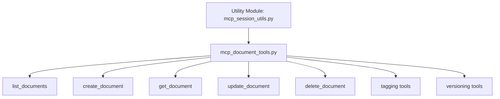

# Implementation Plan: Robust Async Session Management for Document MCP Tools

## Objective
Resolve the persistent `greenlet_spawn has not been called` async context error in document-related MCP tools by implementing a robust, consistent async session management approach that integrates properly with FastMCP's execution context.

## Background
- The error arises because the current method of obtaining the async SQLAlchemy session in document MCP tools uses FastAPI's dependency pattern (`get_db_session`), which does not correctly propagate the async context when tools are executed by FastMCP.
- Memory and project MCP tools function correctly with their session management pattern, which does not use the `ctx` parameter.
- Previous attempts to use the `ctx` parameter in document tools encountered issues, including circular imports and inconsistent usage.
- The MCP server core stores the `AsyncSessionFactory` in the application lifespan context, accessible via FastMCP's `Context` object.
- Proper async context propagation is critical for SQLAlchemy's async ORM operations, especially for update operations involving `flush` and `refresh`.

## Scope
- Refactor all document MCP tools to obtain the async session from FastMCP's `Context` object, leveraging the stored `AsyncSessionFactory`.
- Remove reliance on FastAPI's `get_db_session` dependency within MCP tools.
- Implement consistent session lifecycle management with explicit commit, rollback, and close operations.
- Ensure no circular import issues arise from the new session acquisition method.
- Maintain compatibility with existing helper functions for database operations.
- Add detailed logging for session management and error handling.
- Update all document tools: `list_documents`, `create_document`, `get_document`, `update_document`, `delete_document`, `add_document_tag`, `remove_document_tag`, `list_document_versions`, `get_document_version`, `create_document_version`, `delete_document_version`.

## Detailed Tasks

### 1. Define Helper to Get Session from MCP Context
- Create an async helper function `get_session_from_mcp_context(ctx: Context) -> AsyncSession` that:
  - Accesses `ctx.request_context.lifespan_context["db_session_factory"]`.
  - Creates and returns a new `AsyncSession` instance.
  - Handles errors if the session factory is missing or context structure is invalid.

### 2. Implement Async Context Manager for Session Lifecycle
- Define an `asynccontextmanager` `managed_mcp_session(ctx: Context)` that:
  - Uses `get_session_from_mcp_context` to acquire a session.
  - Yields the session to the caller.
  - On exit, commits if no exceptions, otherwise rolls back.
  - Ensures session is closed in all cases.
  - Adds detailed logging at each step.

### 3. Refactor Document MCP Tools
- Modify all document MCP tool functions to:
  - Accept a `ctx: Context` parameter as the first argument.
  - Use `async with managed_mcp_session(ctx) as session:` to obtain the session.
  - Perform database operations using the session.
  - Remove any direct calls to `get_db_session` or `get_session_from_factory`.
  - Handle exceptions gracefully with rollback and error logging.
  - Return appropriate success or error responses.

### 4. Resolve Circular Import Issues
- If circular imports occur due to helper function locations, consider:
  - Moving `get_session_from_mcp_context` and `managed_mcp_session` to a dedicated utility module.
  - Adjusting import statements accordingly.

### 5. Testing and Validation
- Develop comprehensive tests covering all document MCP tools.
- Verify that the `greenlet_spawn` error no longer occurs during update or other operations.
- Confirm that all tools behave correctly with proper transaction management.
- Monitor logs for session lifecycle and error details.

### 6. Documentation
- Update project documentation to reflect new session management approach.
- Document usage patterns for MCP tool developers.
- Note any changes in tool function signatures (addition of `ctx` parameter).

## Risks and Mitigations
- **Risk:** Introducing `ctx` parameter may break existing clients or tools expecting previous signatures.  
  **Mitigation:** Communicate changes clearly; consider versioning or deprecation strategy.
- **Risk:** Mismanagement of session lifecycle could cause resource leaks or inconsistent state.  
  **Mitigation:** Use `asynccontextmanager` and thorough logging to ensure proper handling.
- **Risk:** Circular imports may complicate refactoring.  
  **Mitigation:** Use dedicated utility modules and careful import structuring.

## References
- SQLAlchemy AsyncIO: https://docs.sqlalchemy.org/en/20/orm/extensions/asyncio.html
- FastAPI Dependencies: https://fastapi.tiangolo.com/tutorial/dependencies/
- FastMCP Documentation (as available)
- Greenlet Usage in SQLAlchemy Async: https://docs.sqlalchemy.org/en/20/orm/extensions/asyncio.html#greenlet-usage

## Next Steps
- Await approval to proceed with implementation.
- Begin by defining session acquisition helpers and context managers.
- Refactor document MCP tools incrementally.
- Perform testing and validation after each major change.
- Address any issues or feedback promptly.

---

## Extended Implementation Plan

**Proposed Implementation Plan for Document MCP Tools Refactor**

1. Create Utility Module (src/mcp_session_utils.py)  
   - Define `async def get_session_from_mcp_context(ctx: Context) -> AsyncSession`  
     • Extract `db_session_factory` from `ctx.request_context.lifespan_context`  
     • On KeyError or other exceptions, log and raise a clear `RuntimeError`  
   - Define `@asynccontextmanager async def managed_mcp_session(ctx: Context)`  
     • Acquire session via `get_session_from_mcp_context`  
     • Yield session  
     • On exit, commit if no exception, otherwise rollback, then close  
     • Add entry/exit logging  

2. Replace Session Acquisition in `src/mcp_document_tools.py`  
   - Remove existing `get_session_from_mcp_context` and any `get_db_session` or `get_session_from_factory` usage  
   - Import `managed_mcp_session` from `src.mcp_session_utils`  
   - Update every MCP tool signature to accept `ctx: Context` as first parameter  
   - Wrap database operations in `async with managed_mcp_session(ctx) as session:`  
   - Remove manual `session.commit()` calls (handled by context manager) or keep explicit commits before return if desired  

3. Refactor Each Document MCP Tool  
   A. `list_documents`  
   B. `create_document`  
   C. `get_document`  
   D. `update_document`  
   E. `delete_document`  
   F. `add_document_tag` / `remove_document_tag`  
   G. `list_document_versions` / `get_document_version`  
   H. `create_document_version` / `delete_document_version`  
   - For each:  
     • Use `managed_mcp_session(ctx)`  
     • Call existing `src/mcp_db_helpers_document` functions with the new session  
     • Rely on context manager for commit/rollback  

4. Resolve Imports & Circular Dependencies  
   - Ensure `src/mcp_session_utils.py` only imports `Context` and doesn’t import document tools  
   - In `mcp_document_tools.py`, import only from `mcp_session_utils` and helpers  

5. Testing and Validation  
   - Run existing test suite against refactored tools  
   - Add/update tests to verify session lifecycle:  
     • Tools succeed and commit on normal flows  
     • Tools rollback on simulated exceptions  
     • `greenlet_spawn` error no longer occurs  
   - Manually test via MCP client calls  

6. Documentation Updates  
   - Update README and developer docs to describe new helper module and session pattern  
   - Note change in tool signatures (ctx parameter) and deprecation strategy if any  

**Next Steps**  
- Review this extended plan and confirm before implementation.  
- When ready to proceed, please toggle to Act mode; I will then scaffold the utility module and incrementally refactor the document MCP tools.
